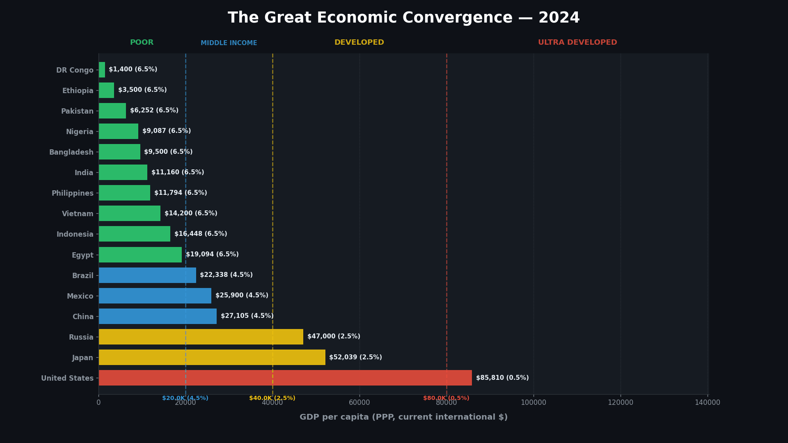

# 🌐 The Great Economic Convergence (2024 – 2100)

> An animated simulation modeling long-term global GDP per capita convergence based on diminishing-returns growth rate tiers.



---

## 📌 Overview

**The Great Economic Convergence** visualizes how developing economies with lower starting GDP per capita catch up with high-income economies over time. Using an automated tier-based compound growth model, countries in lower income bands grow faster and automatically transition into slower growth bands as their income increases.

---

## 📈 Growth Model Assumptions

Growth rates are determined by current GDP per capita (PPP, current international \$) and recalculated annually:

| Income Band (GDP per capita) | Annual Growth Rate | Classification / Tier | Color Code |
| :--- | :---: | :--- | :---: |
| **< \$20,000** | **6.5%** | Low Income / Emerging | 🟢 Green (`#2ecc71`) |
| **\$20,000 – \$40,000** | **4.5%** | Lower-Middle Income | 🔵 Blue (`#3498db`) |
| **\$40,000 – \$80,000** | **2.5%** | Upper-Middle Income | 🟡 Gold (`#f1c40f`) |
| **≥ \$80,000** | **0.5%** | High Income / Developed | 🔴 Red (`#e74c3c`) |

---

## ✨ Features

- **Interactive Display & Auto-Save**: Preview the live animation window during execution and automatically export to both **GIF** (`great_economic_convergence.gif`) and **MP4** (`great_economic_convergence.mp4`).
- **Dark Aesthetic & Dynamic Color Coding**: Bars dynamically change color as economies cross income thresholds into higher growth tiers.
- **Offline & Online Scripts**: Supports both offline historical dataset execution and online data fetching pipelines.
- **Adjustable Playback Pace**: Configured for clear, slow-paced visualization (4 frames per second).

---

## 🚀 Quick Start

### 1. Installation

Clone the repository and install the dependencies:

```bash
git clone https://github.com/ishandutta2007/The-Great-Economic-Convergence.git
cd The-Great-Economic-Convergence
pip install -r requirements.txt
```

### 2. Running the Offline Simulation

Run the offline version using the local 2024 dataset (`great_economic_convergence_data_2024.csv`):

```bash
python great_economic_convergence_offline.py
```

---

## 📁 Repository Structure

```text
.
├── great_economic_convergence_offline.py  # Offline simulation script with live display & video export
├── great_economic_convergence.py          # Online data fetch & simulation script
├── great_economic_convergence_data_2024.csv # Offline baseline dataset (World Bank 2024)
├── great_economic_convergence.gif         # Rendered GIF animation
├── great_economic_convergence.mp4         # Rendered MP4 video output
├── requirements.txt                       # Python dependencies
└── README.md                              # Project documentation
```

---

## 📊 Data Source

Baseline data is sourced from:
- **World Bank World Development Indicators (WDI)** — GDP per capita, PPP (current international \$), 2024.

---

## 📄 License

This project is open-source and available under the [MIT License](LICENSE).
